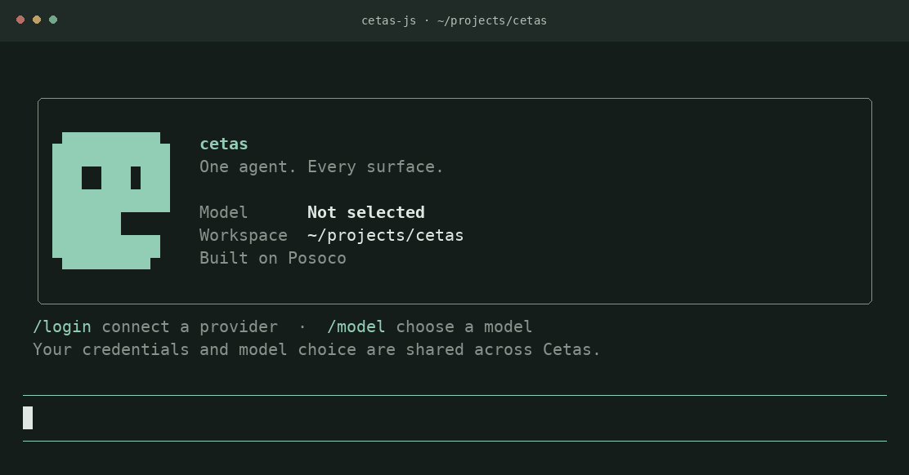

<div align="center">
  <picture>
    <source media="(prefers-color-scheme: dark)" srcset="docs/assets/cetas-symbol-dark.svg">
    
  </picture>
  <h1>Cetas</h1>
  <p><strong>一个 Agent，多种入口。</strong></p>
  <p>在终端、编辑器和脚本中使用的编程 Agent。<br>以 MoonBit 构建，由 <a href="https://github.com/colmugx/posoco">Posoco</a> 驱动。</p>
  <p>
    <a href="https://github.com/colmugx/cetas/actions/workflows/ci.yml"></a>
    <a href="LICENSE"></a>
    <a href="https://www.moonbitlang.com"></a>
  </p>
  <p><a href="https://github.com/colmugx/cetas/releases/tag/cetas-v0.7.0">下载</a> · <a href="#快速开始">快速开始</a> · <a href="#文档">文档</a> · <a href="README.md">English</a></p>
</div>



<p align="center"><sub>图示为 main 分支的 <code>cetas-js</code> 开屏，已发布的二进制版本可能使用较早的界面。</sub></p>

Cetas 能阅读代码、修改文件、执行命令，并实时展示工作过程。你可以在终端中对话，通过 ACP 把它接入编辑器，也可以从脚本中交给它一个任务。

产品逻辑集中在 **`cetas-core`**。各入口基于 [Posoco](https://github.com/colmugx/posoco) 组装同一个 Agent 身份、提示词和生命周期，再接入各自的界面与协议。模型配置、凭据和会话存储使用共享的 Cetas 主目录。

## 为什么使用 Cetas

- **直接处理代码仓库。** 读写和编辑文件，按路径、文本或语法结构搜索，执行 Bash 或 PowerShell 命令。
- **自由选择模型。** Provider 扩展包括 OpenAI、OpenAI 兼容接口、DeepSeek、Kimi、OpenRouter、Z.ai 和 OpenCode Zen；交互式终端通过 `/login` 和 `/model` 完成配置。
- **扩展工作流。** 加载 skills，在交互式终端与 ACP 入口连接 MCP 工具；功能组合由明确的 recipe 定义。
- **保持对话连贯。** `cetas-js` 支持流式响应、工具活动展示、追加任务队列、会话浏览与回退。
- **选择合适的入口。** 日常工作使用交互式终端，编辑器使用 ACP，自动化使用单次任务 runner。

## 快速开始

### 1. 下载交互式终端

已发布的 **Cetas v0.7.0** 终端程序名为 `cetas-bun`，内置 Bun 运行时。使用二进制程序不需要安装 Bun 或 MoonBit。

| 平台 | 下载 |
| --- | --- |
| macOS · Apple Silicon | [cetas-bun-darwin-arm64.tar.gz](https://github.com/colmugx/cetas/releases/download/cetas-v0.7.0/cetas-bun-darwin-arm64.tar.gz) |
| Linux · x64 | [cetas-bun-linux-x64.tar.gz](https://github.com/colmugx/cetas/releases/download/cetas-v0.7.0/cetas-bun-linux-x64.tar.gz) |
| Windows · x64 | [cetas-bun-windows-x64.zip](https://github.com/colmugx/cetas/releases/download/cetas-v0.7.0/cetas-bun-windows-x64.zip) |

解压后，**从需要处理的项目目录**启动程序。例如：

```bash
cd /path/to/your/project
/path/to/extracted/cetas-bun
```

Windows 使用解压后的 `cetas-bun.exe`。[发布页](https://github.com/colmugx/cetas/releases/tag/cetas-v0.7.0)还提供 ACP、runner 程序和校验文件。Memoh 使用独立的版本系列；这些入口请下载带 Cetas 标签的版本。

### 2. 连接模型

在终端中输入：

```text
/login
/model
```

选择 Provider 并完成认证，再选择模型。配置和凭据保存在 `~/.cetas/` 下，可供其他 Cetas 入口复用。

### 3. 交给它一个任务

```text
解释这个仓库的认证流程。
```

```text
修复失败的测试，并告诉我修改了什么。
```

通过 `@path` 添加文件引用，使用 `/help` 查看命令与快捷键。权限模式可通过 `/permission readonly`、`/permission workspace_write`、`/permission interactive` 或 `/permission yolo` 选择；具体行为见[配置指南](docs/configuration.md)。

## 多种入口

| 入口 | 适用场景 | 使用方式 |
| --- | --- | --- |
| **交互式终端** · `cetas-js` | 流式对话、模型与登录选择器、会话管理和回退 | `cetas-bun` · [从源码构建](docs/development.md#interactive-terminal) |
| **编辑器** · `cetas-acp` | 支持 Agent Client Protocol 的编辑器 | `cetas-acp` · [接入说明](docs/configuration.md#editor--acp) |
| **自动化** · `cetas-run` | 每次执行一个任务、脚本和 JSONL 输出 | `cetas-run` · [使用指南](cetas-run/README.mbt.md) |
| **原生终端** · `cetas-native` | 正在开发的 MoonBit + Rust 终端入口 | [当前状态与构建说明](cetas-native/README.md) |
| **Web** · `cetas-web` | 正在开发的浏览器入口 | [本地开发](cetas-web/README.md) |

各入口的能力有所不同，[composition roster](composition/recipes.csv) 是功能组合的准确信息源。共享 Cetas 主目录不代表所有入口具有相同的界面，或都支持跨入口继续同一段会话。

<details>
<summary><strong>从脚本执行单次任务</strong></summary>

配置 Provider 后，使用 Cetas 发布版中的 runner：

```bash
cetas-run -- "解释这个仓库"
cetas-run --jsonl --stream -- "总结这些修改"
cetas-run --session <id> -- "继续"
```

普通回答输出到 stdout；诊断和生命周期信息输出到 stderr。安装 [MoonX](https://github.com/moonbitlang/moon) 后，也可以运行 Mooncakes 模块：

```bash
moonx colmugx/cetas-run -- -- "解释这个仓库"
```

原生与沙箱 Wasm 目标的区别见 [runner 指南](cetas-run/README.mbt.md)。

</details>

## 基于 Posoco

Cetas 的诞生，是为了让 [Posoco](https://github.com/colmugx/posoco) 走进实际使用：用一个能解决日常编程问题的产品，展示协议优先的 Agent 框架能做什么。

Posoco 提供 Agent 基础和扩展端口，Cetas 定义产品行为，各入口负责界面和传输协议。这样的分工让产品可以扩展到不同场景，同时保持同一个核心身份。

## 文档

| 指南 | 内容 |
| --- | --- |
| [配置](docs/configuration.md) | Provider、权限、共享状态、MCP 与 ACP 接入 |
| [开发](docs/development.md) | 工作区检出、依赖、构建与检查 |
| [架构](docs/architecture.md) | 产品职责、仓库结构与扩展组合 |
| [Composition](composition/README.md) | Recipe 定义与生成流程 |
| [更新日志](CHANGELOG.md) | Cetas 核心版本历史 |
| [Memoh 集成](cetas-memoh/README.mbt.md) | 独立版本的 Memoh runtime 及其状态目录 |

## 参与贡献

欢迎问题报告、聚焦的改进和新入口集成。[提交 issue](https://github.com/colmugx/cetas/issues) 时请附上入口、版本、平台和复现步骤；提交 PR 时请运行[开发指南](docs/development.md)中与改动相关的检查。

扩展能力请从 composition roster 入手，产品行为请从 `cetas-core` 入手。

## 许可证

[Apache 2.0](LICENSE)。
